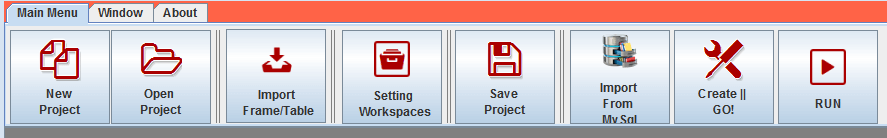
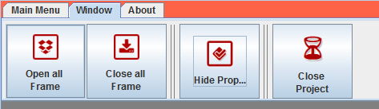
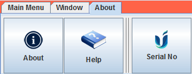

Undagi Code CodeIgniter adalah sebuah aplikasi yang dapat membantu kamu dalam pembuatan program sesuai, dan kamu tidak perlu membuat atau belajar coding lagi. Hanya beberapa klik saja aplikasi berbasis website yang kamu butuhkan bisa digunakan dalam waktu kurang dari 5 menit.

## Menu dan Fitur Undagi Code

Bagian - bagian menu Undagi Code Creator terdiri dari 3 yaitu menu :

## Main Menu

* New Project

    Menu yang digunakan untuk membuat project baru.
* Open Project

    Menu untuk membuka project yang sudah pernah dibuat sebelumnya, untuk menambahkan data atau mengubah project sebelumnya.
* Import Frame / Table

    Fitur untuk mengubah table atau database yang sudah ada dari DBMS MySQL untuk dijadikan aplikasi baru. Fitur ini akan sangat berguna jika aplikasi yang ingin kamu buat memiliki banyak tabel. Sehingga kamu tidak perlu membuat tabel dari awal dan langsung menggunakannya dalam pembuatan aplikasi
* Workspaces

    Menu yang digunakan untuk mengatur posisi folder dari code yang dibuat. Dengan begitu hasil project atau aplikasimu akan lebih rapi dan tidak sulit dicari.
* Save Project

    Menyimpan Project yang telah dibuat sehingga bisa kamu ubah maupun perbaiki suatu saat, project inilah yang akan dibuka pada saat menggunakan menu open project.
* Create & Go

    Adalah fitur utama disinilah code program akan dibuat dari table / frame yang sudah kamu buat sebelumnya. Dalam proses ini kamu hanya tinggal menunggu hingga proses loading selesai. Dan jika sudah kamu tinggal memilih Run untuk menjalankan aplikasinya.
* Run

    Fitur yang sangat membantu mu dalam menjalankan aplikasi yang sudah dibuat. Jadi kamu tidak perlu menggunakan CMD atau terminal untuk menjalankan secara manual. Hanya sekali klik saja Aplikasi yang kamu buat langsung terbuka di browsermu.

## Window

* Open All Frame

    Menu yang digunakan untuk menampilkan semua frame atau table yang sudah dibuat. Dengan begitu kamu bisa melihat dan mengecheck masing - masing frame atau table yang sudah kamu buat.
* Close All Frame

    Menu untuk menutup semua frame / table yang sudah kamu buat.
* Hide Property

    Fitur untuk menyembunyikan property / keterangan project di sebelah kanan program.
* Close Project

    Menu untuk menutup project yang sedang terbuka.

## About

* About

    Disini kamu bisa melihat keterangan maupun versi Undagi Code Creator yang sedang terinstall.
* Help

    Menu bantuan jika kamu mengalami kesulitan dalam penggunaan program Undagi Code Creator.
* Serial No.

    Disini kamu bisa melihat serial nomer program Undagi Code Creator yang kamu miliki. Serial Nomor ini tidak bisa dibagikan ke perangkat lainnya.

Setelah mengetahui menu - menu yang ada selanjutnya kamu bisa mulai menggunakan Undagi Code Creator CodeIgniter dengan lancar.

Oiya menu - menu tadi akan bertambah kedepannya.
