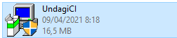
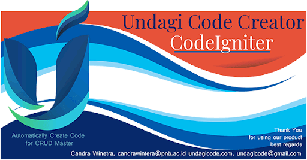
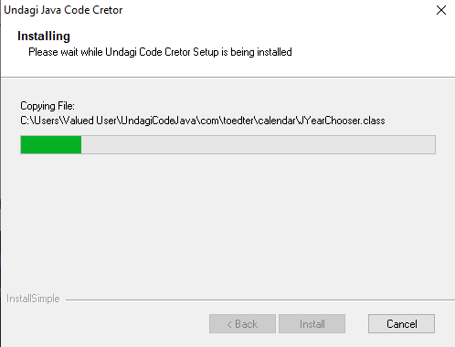
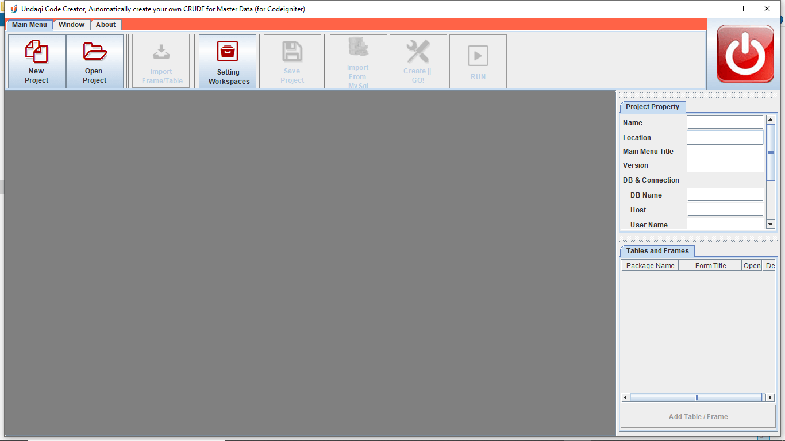

Sebelum kamu mulai menggunakan Undagi Code Creator untuk membuat sebuah aplikasi, kamu haru menginstallnya terlebih dahulu.

Caranya sangat mudah kok bahkan kamu tidak perlu menunggu lama proses instalasinya. Penasaran kan yuk kita mulai tahap instalasi Undagi Code Creator.

## Instalasi Undagi Code Creator

Sebelumnya pastikan kamu sudah menginstal Java pada perangkatmu. Java selain bahasa pemrograman yang sangat populer sehingga kami memilihnya sebagai syarat utama dalam penggunaan Undagi Code Creator ini.

Tapi tenang kamu engga perlu harus jago coding menggunakan bahasa java dulu sebelum menggunakan Undagi Code Creator. Kamu hanya perlu menginstallnya saja.

Jika kamu sudah menginstall java langkah selanjutnya adalah :

### File Instalasi



Pastinya kamu sudah memiliki file instalasi yang diberikan saat kamu sudah menyelesaikan pembayaran, ataupun kamu ingin mencoba terlebih dahulu Undagi Creator

Kamu bisa menempatkan file instalasi ini dimana saja , sebagai contoh kita akan menaruhnya di dalam desktop.

Setelah itu double klik pada file instalasi dan akan muncul splash screen seperti berikut ini.



Disini kamu bisa memilih tombol next, Jika proses instalasi bisa berjalan maka kamu akan melihat proses loading seperti ini.



Setelah proses instalasi berhasil kamu akan melihat shortcut aplikasi pada desktop, dan semua file instalasi akan tersimpan sesuai dengan folder di dalam user mu. Nah setelah tahap ini kamu sudah bisa menjalankan aplikasimu.

```Note : Pada kasus program yang kamu install tidak bisa berjalan normal setelah proses instalasi terkadang itu karena path instalasi Java yang tidak terbaca dengan benar.```

### Untuk itu langkah yang bisa kamu coba untuk memperbaikinya adalah

- Mencara folder tempat instalasi dengan mengklik kanan shortcut aplikasi yang berada di desktop.
- Pilih open source folder, untuk melihat tempat penyimpanan folder instalasinya.
- Selanjutnya cari file yang bernama launcher.bat dan buka file tersebut menggunakan editor notepad.
- Caranya dengan klik kanan pada file tersebut, Lalu pilih open with notepad.
- Ubah path java yang ada pada baris kedua file tersebut, dan sesuaikan dengan path java pada perangkatmu.
- contohnya path C:\java\jdk1.8.0_111\bin.
- Simpan kembali file tersebut dan coba jalankan kembali program melalui shortcut yang berada di desktop kamu.

## Registrasi Lisensi

Setelah Undagi Code creator bisa dijalankan maka akan tampil halaman utama seperti ini.



Jika kamu melihat muncul popup untuk registrasi maka kamu bisa pilih yes, ataupun jika kamu ingin mencoba trial saja kamu bisa memilih yes juga.

Selanjutnya kamu akan melihat popup untuk registrasi lisensi yang berisi email, dan nama kamu. Serial key akan dibuat secara otomatis saat kamu menekan tombol "get Serial Key" pastikan semua data sudah kamu isi ya.

```Note : Pastikan perangkat kamu terhubung ke internet karena proses registrasi lisensi dilakukan secara online untuk menghindari pembajakan.```

### Langkah - langkah registrasi lisensi

- Muncul popup yang berisi email, nama dan serial nomor.
- Masukkan alamat email```(waktu memesan Undagi Code Creator)```
- Klik tombol "Get Serial No.", jika emailmu sudah terdaftar maka serial number akan otomatis terisikan.
- Nama juga akan otomatis terisi jika berhasil.
- Kemudian kamu hanya tinggal memilih OK jika serial number sudah kamu dapatkan.
- Horay !!! Undagi Code Creator kamu sudah terdaftar.

```Note : Jika tidak berhasil melakukan registrasi karena kamu sedang offline```

- Kamu bisa mengirimkan nomor program Undagi Code Creator ```(nomor ini berada di bagian atas popup registrasi)```
- Kirimkan nomor tersebut ke dalam email undagicode@gmail.com atau candrawinetra@pnb.ac.id
- Setelah menerima serial nomor kamu bisa melakukan registrasi lisensi secara manual dengan memasukkan nomor yang kamu dapatkan.

```Note: Penting yang wajib kamu ketahui```

- Registrasi dilakukan secara online.
- Satu alamat email hanya dapat digunakan untuk 1 lisensi.
- Jika alamat email yang kamu gunakan sudah terdaftar, maka tidak bisa digunakan untuk registrasi kedua kalinya.
- Atau dengan kata lain tidak bisa dipindahkan ke Perangkat lain.

Selanjutnya kamu dapat melihat fitur - fitur Undagi Code Creator untuk aplikasi berbasis Website maupun aplikasi berbasis Desktop.
