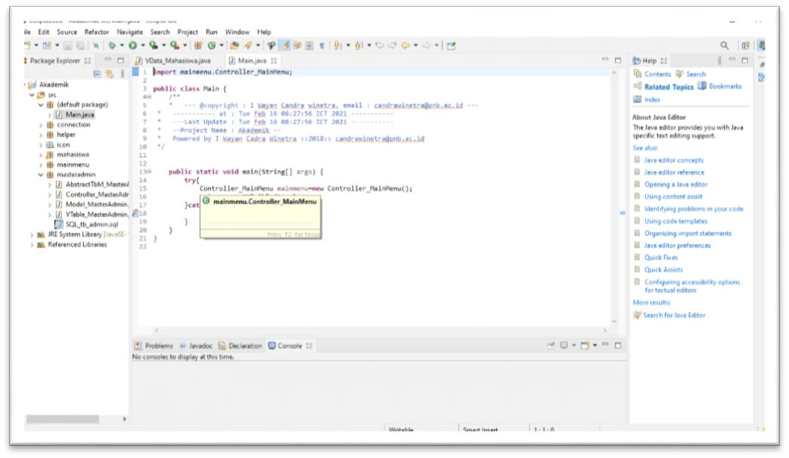
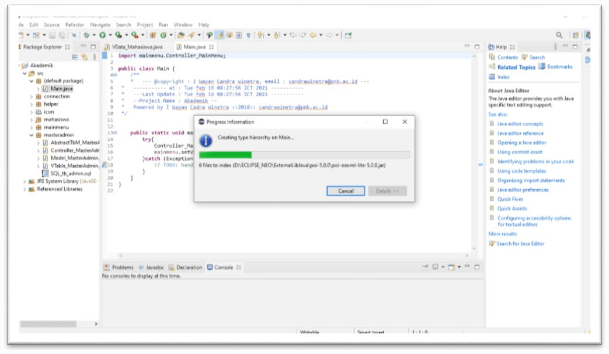

Membuat project dengan Undagi Code Creator Java itu cukup mudah, dan pastinya kamu akan ingat setelah pertama kali mencobanya.

Untuk itu langkah pertama yang bisa kamu lakukan adalah membuka program Undagi Code Creator Java, yang berada pada desktop mu.

Sebelum membuat aplikasi pastikan kamu sudah menyalakan XAMPP pada perangkatmu, gunanya adalah selagi kamu menyiapkan projectmu, Undagi Code Creator akan membuat database dan juga tabel.

`Kamu bisa membaca tentang langkah - langkah instalasi dan cara penggunaan XAMPP` [disini](https://undagicode.com)

Setelah itu kamu bisa mengikuti langkah - langkah berikut :

## Pemilihan Workspaces

Sebelum membuat project secara langsung, kami menyarankan untuk menentukan posisi workspace atau tempat menyimpan aplikasi yang sudah jadi. Dengan begitu kamu tidak perlu bingung mencari dimana hasil program tersimpan.

Untuk itu kamu bisa memilih menu `Workspaces`, kemudian memilih lokasi folder yang kamu inginkan. Setelah itu kamu bisa memilih salah satu folder dengan klik tombol "Open".

Nantinya semua file dan folder dalam hasil program akan tersimpan di posisi folder yang sudah kamu pilih tadi.

## Create a New Project

Setelah memilih workspace untuk lokasi penyimpanan hasil program, selanjutnya adalah pembuatan project baru. Kamu bisa memilih menu `New Project` kemudian akan muncul popup seperti dibawah ini.

Pada jendela tersebut kamu bisa melengkapi sesuai project yang sedang kamu buat.

* `Project Name` nama ini akan digunakan untuk penamaan folder aplikasi yang sudah akan kamu buat. Nama ini juga dapat diubah sesuai keinginnan.
* `Version` (optional) kamu dapat mengisi atau menggunakan versi defaultnya. Ini diperlukan jika kamu ingin mengembangan project menjadi lebih komplex. Sehingga memberikan versi sangat memudahkan untuk manajemen project tersebut.
* `Location` tempat penyimpanan hasil aplikasi yang sudah dibuat. Jika kamu sudah memilih folder untuk workspacemu, maka kolom ini tidak perlu di ubah lagi.
* `Main Menu Title` yaitu penamaan halaman project yang sedang kamu buat, dengan memberikan nama yang sesuai kamu dapat dengan mudah mengingat project yang sedang kamu buat.
* `Database` adalah kolom untuk koneksi ke database yang kamu miliki.
  
  * `Host Name` Kamu bisa mengisi nama host atau alamat IP jika kamu menggunakan database dari server yang online. Secara default berisi **localhost**
  
  * `Database Name` adalah nama dimana kamu menyimpan data - data yang kamu olah menggunakan hasil aplikasi nantinya. Kamu dapat membuat nama yang belum ada di dalam aplikasi `PHPMyadmin` mu jika ingin membuat database baru. Jika kamu ingin menggunakan database yang sudah ada kamu bisa memasukkan nama database tersebut.
  
  * `User Name` username yang kamu miliki untuk masuk ke dalam database mu, atau mengakses melalui aplikasi `PHPMyadmin`, secara default adalah **root**

  * `Password` yaitu password yang diperlukan untuk masuk ke dalam database, secara default password tidak terisi. Jika kamu memerlukan password untuk mengakses `PHPMyadmin` masukkanlah password tersebut juga.
* `Creator Name` Nama ini digunakan untuk menambah keterangan di dalam aplikasi yang kamu buat. Sehingga kamu tidak perlu menambah credit secara manual pada aplikasi.
* `E-mail` Alamat email yang akan diisi setelah nama creator, jika orang lain melihat hasil aplikasimu maka akan mudah menemukan pembuatnya.

Jika semua kolom sudah kamu lengkapi langkah selanjutnya adalah menyimpannya. Dengan memilih tombol `Save`.

Berikut ini adalah keterangan hasil project yang sudah kamu buat.

## Add Frame atau Table

Setelah pembuatan project, kamu bisa membuat tabel atau frame, table inilah yang akan dibuat di dalam database, dan digunakan untuk mengolah data di dalam aplikasimu. Kamu bisa membuat tabel dengan memilih tombol `Add table / frame` di bagian pojok kanan bawah.

### Langkah selanjutnya setelah muncul window tabel adalah

Mengisi kolom - kolom yang diperlukan dalam pembuatan tabel, kolom tersebut adalah.

* `Master Name` yaitu nama unik yang digunakan untuk menamai halaman, dan juga hasil aplikasimu.
* `Form Title` nama yang akan ditempatkan pada saat kamu melakukan penambahan data di dalam aplikasi. Nama ini juga akan digunakan pada nama table atau frame yang sedang kamu buat.
* `Table Name` nama tabel yang akan dibuat di dalam database, usahakan agar nama ini tidak sama dengan nama tabel lainnya.
* `Number of Columns` jumlah kolom atau field di dalam tabelmu. Jika kamu pernah membuat table di database menggunakan aplikasi `PHPMyadmin` kolom inilah yang digunakan untuk menyimpan data yang kamu butuhkan.
* `Type Frame` Pilih Type JFrame yang akan dibuat, Jika mimilih JInternalFrame maka tampilan frame akan berada didalam frame menu utama, sedangkan jika memilih JFrame
maka tampilan frame akan dibuat modal dan berdiri diluar menu utama.
* `Layout Frame` Pilih type tampilan frame yang akan dibuat untuk insert dan updating data pada check box (Single Frame (left), Single Frame (Right), atau Double Frame). Tampilan insert dan update data dapat dibuat menjadi 1 frame dengan table data (single frame) atau beda frame (double frame)

#### Penjelasan kolom tabel

* `Column Name` yaitu nama dari field atau kolom table yang akan kamu buat. Nama ini akan digunakan pada saat pembuatan kolom di database.
* `Type` adalah type data yang digunakan dalam penyimpanan data. Untuk setiap type memeliki nilai default yang berbeda. Seperti Integer dengan nilai 8, Varchar / Char dengan nilai 10 namun bisa diubah. Type ini juga menentukan jenis kolom untuk menginputkan data nantinya.
* `Width` adalah nilai atau panjang sebuah kolom atau field, bisa diubah jika kamu memilih type char ataupun varchar saja.
* `Primary` memilih apakah kolom tersebut menjadi primary key dalam tabel yang akan dibuat.
* `A_I` jika type yang kamu pilih adalah integer maka nilainya akan terus bertambah dan kolom tidak ditampilkan.
* `Search` Secara default semua field yang ada bisa difilter sesuai nilainya. Untuk itu tidak perlu mengubah pilihan ini.
* `Column Title` nama yang akan digunakan pada form untuk penamaan kolom input.
* `Editor` type editor yang digunakan untuk menginputkan data. Jika memilih type data integer maka dapat pilihan menggunakan editor Text Box, Text Area, maupun Combo Box.

* `Combo Box Item` adalah isi combobox jika memilih editor combobox.
* `Del` yaitu pilihan untuk menghapus kolom atau field yang tidak dibutuhkan.
* `Add / Insert New Field` jika kamu ingin menambah kolom atau field baru, bisa menambahkannya dari sini.
* `Column` Memilih posisi kolom yang akan ditambah, bisa menempatkan kolom baru di bagian tengha maupun diakhir.
* `Save` yaitu tombol untuk menyimpan perubahan atau table yang sudah kamu buat.
* `Close` Untuk menutup window table yang sedang kamu buat, dan dapat dibuka kembali pada property table di sebelah kanan.

Jika sudah kamu simpan semua table yang kamu buat maka inilah hasilnya di dalam folder tempat penyimpanan projectmu.

## Buat Aplikasi dengan Create `&` Go

Untuk membuat aplikasi menggunakan bahasa pemrograman `PHP` dengan framework Java sangat mudah jika kamu menggunakan Undagi Code Creator. Jika kamu sudah selesai membuat tabel maka kamu hanya perlu memilih tombol `Create & Go`.

Maka kamu hanya tinggal menunggu proses berjalan dan hasil codingan tersimpan dengan nama `(nama_project)` di dalam folder project yang sudah kamu simpan sebelumnya.

Hasilnya akan tersimpan di dalam folder seperti gambar dibawah ini

## Menjalankan Aplikasi

Sebelum menjalankan aplikasi yang sudah kamu buat pastikan kamu sudah menyalakan XAMPP berupa **Apache Server** dan juga **DBMS MySQl**.

### Menjalankan Program menggunakan Eclipse IDE

* Buat Project di Eclipse IDE, untuk nama project sesuaikan dengan nama yang dibuat pada saat pembuatan aplikasi menggunakan Undagi Code Creator. Lalu saat muncul pilihan untuk membuat modul pilih `Don't Create`. Dan tunggu hingga project selesai dibuat.

* Setelah project di Eclipse IDE dibuat maka langkah selnajutnya adalah mengcopy folder yang dibuat Undagi Code Creaotr ke dalam folder `src` pada project Eclipse IDE.
* Folder yang dihasilkan oleh Undagi Code Creator dapat dilihat pada folder `src`. Lokasi folder bisa dilihat seperti gambar dibawah ini.

* Setelah semua folder berhasil tercopy, maka kamu hanya perlu melakukan refresh pada Eclipse IDE. Dengan cara klik kanan, lalu pilih refesh. Jika berhasil package dan kode program akan terlihat pada project Eclipse IDE mu.

### Setting Build Path pada Eclipse IDE

Build path ini diperlukan karena hasil kode program bergantung dengan beberapa external jar, untuk mendukung fitur yang dimiliki. Diantaranya adalah

* `Mig Layout` merupakan package bawaan java sehingga hnaya perlu melakukan setting pada class path saja.
* `Json.Java` digunakan untuk koneksi data yang menggunakan format JSON, contohnya jika menggunakan REST API. Package ini dapat di download pada link [berikut](https://jar-download.com/artifacts/org.json).
* `MySQL Connector` digunakan untuk membuat koneksi ke DBMS MySQL, external package ini dapat didownload pada link [berikut](https://downloads.mysql.com/archives/c-j/)
* `Apache.Poi` digunakan untuk mengeksport data ke dalam file excel, external package ini bisa didwonload di [sini](https://poi.apache.org/download.html)
* `JCalendar` digunakan untuk menampilkan kolom input berupa Date Picker, external package ini dapat didownload pada [link ini](http://www.java2s.com/Code/Jar/j/Downloadjcalendar14jar.htm)

#### Notes

* Untuk external package `Mig Layout` dan `Apache Poi`, wajib disertakan dalam class path.
* External Package yang digunakan untuk koneksi ke dalam database seperti JSON maupun MySQL dapat digunakan salah satu.
* Sedangkan untuk external package JCalendar wajuib disertakan jika ada table yang menggunakan input type date.

Setelah mendownload semua paket Jar yang dibutuhkan, kemudian extrak sehingga semuanya dalam
bentuk Jar. Copy dalam sebuah folder untuk mempermudah pencarian package.

Lakukan setting Build Class Path pada project eclipse dengan mengklik kanan pada project, kemudian
dari menu pilih “Build Path” lalu pilih “Configure Build Path” seperti dibawah.

Setelah menu di klik, kemudian akan muncul jendela Build Path. Pada jendela ini pilihah “Java buld path” pada property yang berada di sebelah kiri panel. Kemudian dari tab menu Java.

Build Path, pilih
tab “Libraries” kemudian dilanjutkan dengan mengklik pada bagian classpath.

Berikut adalah contoh tampilan import external jar file dari libraries class path.

Dari jendela tersebut, pilih tombol “Add External Jar File”, maka dialog open file akan terbuka:

Dari dialog ini, carilah package MigLayout.jar, JCalendar.jar, MySql-Java-connector.jar atau java- json,jar (sesuai dengn type koneksi yang digunakan), dan terakhir tambahkan jar dari package apache poi yang berada pada folder poi, poi-lib, dan ooxml-lib. Setelah add semua file jar tersebut, kemudian pilih “Apply and Close” sehingga jendela ini akan tertutup.

Berikut adalah contoh hasil dari adding external jar file yang dilakukan pada project:

Setelah men-setting build class path tersbut, maka error warning yang terjadi sudah hilang dan kode program sudah siap untuk dieksekusi.

Berikut adalah tampilan kode program setelah tiak ada error warning.

### Membuat Database pada DBMS MySQL dengan PHPMyAdmin

Pembuatan database diperlukan jika kamu memilih MySQL pada saat pembuatan project menggunakan UNdagi Code Creator.

Untuk itu pastikan service apache maupun MySQL sudah berjalan melalui control panel XAMPP. Kemudian buka halaman aplikasi PHPMyAdmin lewat browser seperti gambar berikut.

Selanjutnya buatlah database baru dengan nama yang sama pada saat pembuatan project dengan Undagi Code Creator, setelah berhasil membuat database kemudian klik pada database tersebut lalu pilih menu import.

Selanjutnya pilih gunakan file sql yang dihasilkan pada saat pembuatan project. Jika berhasil maka langkah selanjutnya adalah memilih GO untuk menjalankan proses import pada aplikasi PHPMyAdmin.

Jika proses import telah berhasil maka akan muncul tampilan seperti gambar berikut.

### Menjalankan Project melalui Eclipse IDE

Setelah semuanya selesai dilakukan konfigurasi, langkah selanjutnya adalah membuka kembali project pada Eclipse IDE. dan memilih main class yang akan dijalankan.

Selanjutnya pilih menu Run pada Eclipse IDE. Makan project akan dijalankan.

## Contoh Running Project

Setelah project berhasil dijalankan menggunakan Eclipse IDE maka akan tampil hasil program seperti berikut ini.

Proses insert data akan terlihat seperti ini

Jika kamu ingin mencetak data yang sudah diinputkan maka tampilannya akan seperti ini

