Membuat project dengan Undagi Code Creator CodeIgniter itu cukup mudah, dan pastinya kamu akan ingat setelah pertama kali mencobanya.

Untuk itu langkah pertama yang bisa kamu lakukan adalah membuka program Undagi Code Creator CodeIgniter, yang berada pada desktop mu.

Sebelum membuat aplikasi pastikan kamu sudah menyalakan XAMPP pada perangkatmu, gunanya adalah selagi kamu menyiapkan projectmu, Undagi Code Creator akan membuat database dan juga tabel.

`Kamu bisa membaca tentang langkah - langkah instalasi dan cara penggunaan XAMPP` [disini](https://undagicode.com)

Setelah itu kamu bisa mengikuti langkah - langkah berikut :

## Pemilihan Workspaces

Sebelum membuat project secara langsung, kami menyarankan untuk menentukan posisi workspace atau tempat menyimpan aplikasi yang sudah jadi. Dengan begitu kamu tidak perlu bingung mencari dimana hasil program tersimpan.

Untuk itu kamu bisa memilih menu `Workspaces`, kemudian memilih lokasi folder yang kamu inginkan. Setelah itu kamu bisa memilih salah satu folder dengan klik tombol "Open".

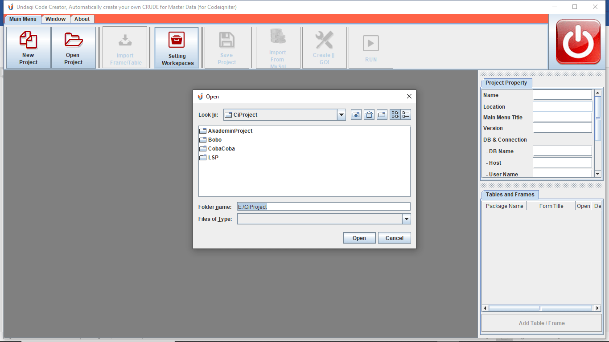

Nantinya semua file dan folder dalam hasil program akan tersimpan di posisi folder yang sudah kamu pilih tadi.

## Create a New Project

Setelah memilih workspace untuk lokasi penyimpanan hasil program, selanjutnya adalah pembuatan project baru. Kamu bisa memilih menu `New Project` kemudian akan muncul popup seperti dibawah ini.


Pada jendela tersebut kamu bisa melengkapi sesuai project yang sedang kamu buat.

* `Project Name` nama ini akan digunakan untuk penamaan folder aplikasi yang sudah akan kamu buat. Nama ini juga dapat diubah sesuai keinginnan.
* `Version` (optional) kamu dapat mengisi atau menggunakan versi defaultnya. Ini diperlukan jika kamu ingin mengembangan project menjadi lebih komplex. Sehingga memberikan versi sangat memudahkan untuk manajemen project tersebut.
* `Location` tempat penyimpanan hasil aplikasi yang sudah dibuat. Jika kamu sudah memilih folder untuk workspacemu, maka kolom ini tidak perlu di ubah lagi.
* `Main Menu Title` yaitu penamaan halaman project yang sedang kamu buat, dengan memberikan nama yang sesuai kamu dapat dengan mudah mengingat project yang sedang kamu buat.
* `Database` adalah kolom untuk koneksi ke database yang kamu miliki.
  
  * `Host Name` Kamu bisa mengisi nama host atau alamat IP jika kamu menggunakan database dari server yang online. Secara default berisi **localhost**
  
  * `Database Name` adalah nama dimana kamu menyimpan data - data yang kamu olah menggunakan hasil aplikasi nantinya. Kamu dapat membuat nama yang belum ada di dalam aplikasi `PHPMyadmin` mu jika ingin membuat database baru. Jika kamu ingin menggunakan database yang sudah ada kamu bisa memasukkan nama database tersebut.
  
  * `User Name` username yang kamu miliki untuk masuk ke dalam database mu, atau mengakses melalui aplikasi `PHPMyadmin`, secara default adalah **root**

  * `Password` yaitu password yang diperlukan untuk masuk ke dalam database, secara default password tidak terisi. Jika kamu memerlukan password untuk mengakses `PHPMyadmin` masukkanlah password tersebut juga.
* `Creator Name` Nama ini digunakan untuk menambah keterangan di dalam aplikasi yang kamu buat. Sehingga kamu tidak perlu menambah credit secara manual pada aplikasi.
* `E-mail` Alamat email yang akan diisi setelah nama creator, jika orang lain melihat hasil aplikasimu maka akan mudah menemukan pembuatnya.

Jika semua kolom sudah kamu lengkapi langkah selanjutnya adalah menyimpannya. Dengan memilih tombol `Save`.
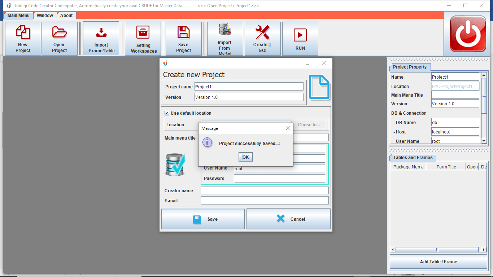
Berikut ini adalah keterangan hasil project yang sudah kamu buat.
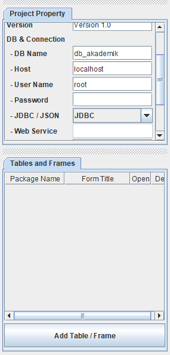

## Add Frame atau Table

Setelah pembuatan project, kamu bisa membuat tabel atau frame, table inilah yang akan dibuat di dalam database, dan digunakan untuk mengolah data di dalam aplikasimu. Kamu bisa membuat tabel dengan memilih tombol `Add table / frame` di bagian pojok kanan bawah.

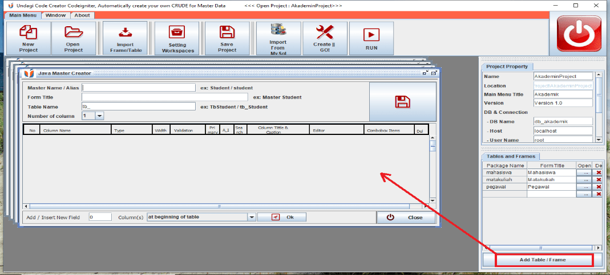

### Langkah selanjutnya setelah muncul window tabel adalah

Mengisi kolom - kolom yang diperlukan dalam pembuatan tabel, kolom tersebut adalah.

* `Master Name` yaitu nama unik yang digunakan untuk menamai halaman, dan juga hasil aplikasimu.
* `Form Title` nama yang akan ditempatkan pada saat kamu melakukan penambahan data di dalam aplikasi. Nama ini juga akan digunakan pada nama table atau frame yang sedang kamu buat.
* `Table Name` nama tabel yang akan dibuat di dalam database, usahakan agar nama ini tidak sama dengan nama tabel lainnya.
* `Number of Columns` jumlah kolom atau field di dalam tabelmu. Jika kamu pernah membuat table di database menggunakan aplikasi `PHPMyadmin` kolom inilah yang digunakan untuk menyimpan data yang kamu butuhkan.

#### Penjelasan kolom tabel

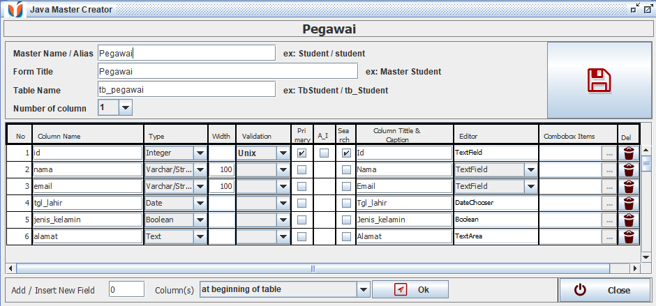

* `Column Name` yaitu nama dari field atau kolom table yang akan kamu buat. Nama ini akan digunakan pada saat pembuatan kolom di database.
* `Type` adalah type data yang digunakan dalam penyimpanan data. Untuk setiap type memeliki nilai default yang berbeda. Seperti Integer dengan nilai 8, Varchar / Char dengan nilai 10 namun bisa diubah. Type ini juga menentukan jenis kolom untuk menginputkan data nantinya.
* `Width` adalah nilai atau panjang sebuah kolom atau field, bisa diubah jika kamu memilih type char ataupun varchar saja.
* `Validation` Membuat validasi data dari type data yang kamu masukkan. Validasi ini sangat penting sehingga tidak sembarang data bisa tersimpan ke dalam database. Sehingga aplikasi yang kamu buat bisa lebih aman. Terdapat berbagai maca pilihan validasi sebagai berikut.

  * Unique yaitu nilai yang dimasukkan atau diubah tidak boleh sama dengan yang ada pada kolom ini, atau harus berbeda.
  * Image jika kamu ingin mengambil input file berupa gambar.
  * Email input khusus untuk email saja.
  * Doc yaitu input khusus untuk file berformat Microsoft Word`(docx)`.
  * PDF yaitu input khusus untuk file berformat PDF.
  * Doc + PDF bisa menerima input file baik itu berformat `(docx)` maupun PDF.

* `Primary` memilih apakah kolom tersebut menjadi primary key dalam tabel yang akan dibuat.
* `A_I` jika type yang kamu pilih adalah integer maka nilainya akan terus bertambah dan kolom tidak ditampilkan.
* `Search` Secara default semua field yang ada bisa difilter sesuai nilainya. Untuk itu tidak perlu mengubah pilihan ini.
* `Column Title` nama yang akan digunakan pada form untuk penamaan kolom input.
* `Editor` type editor yang digunakan untuk menginputkan data. Jika memilih type data integer maka dapat pilihan menggunakan editor Text Box, Text Area, maupun Combo Box.

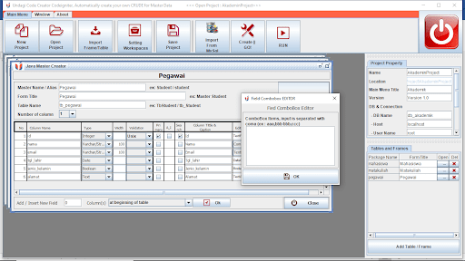

* `Combo Box Item` adalah isi combobox jika memilih editor combobox.
* `Del` yaitu pilihan untuk menghapus kolom atau field yang tidak dibutuhkan.
* `Add / Insert New Field` jika kamu ingin menambah kolom atau field baru, bisa menambahkannya dari sini.
* `Column` Memilih posisi kolom yang akan ditambah, bisa menempatkan kolom baru di bagian tengha maupun diakhir.
* `Save` yaitu tombol untuk menyimpan perubahan atau table yang sudah kamu buat.
* `Close` Untuk menutup window table yang sedang kamu buat, dan dapat dibuka kembali pada property table di sebelah kanan.

Jika sudah kamu simpan semua table yang kamu buat maka inilah hasilnya di dalam folder tempat penyimpanan projectmu.

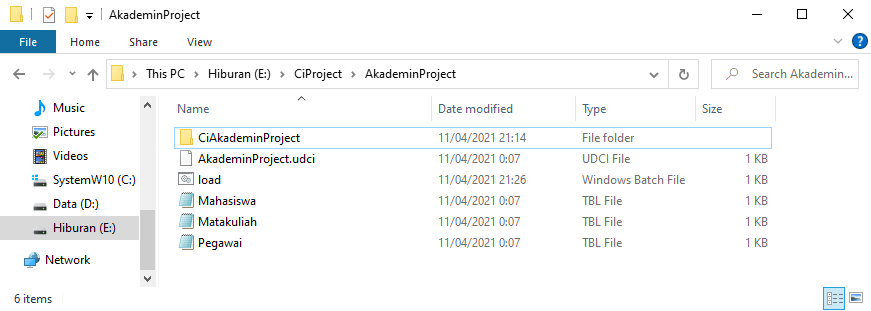

## Buat Aplikasi dengan Create `&` Go

Untuk membuat aplikasi menggunakan bahasa pemrograman `PHP` dengan framework CodeIgniter sangat mudah jika kamu menggunakan Undagi Code Creator. Jika kamu sudah selesai membuat tabel maka kamu hanya perlu memilih tombol `Create & Go`.

Maka kamu hanya tinggal menunggu proses berjalan dan hasil codingan tersimpan dengan nama `CI(nama_project)` di dalam folder project yang sudah kamu simpan sebelumnya.

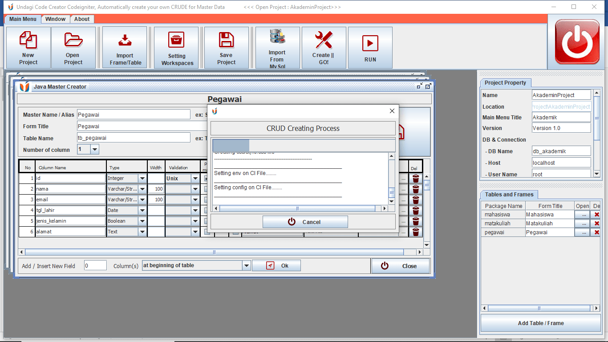

Hasilnya akan tersimpan di dalam folder seperti gambar dibawah ini

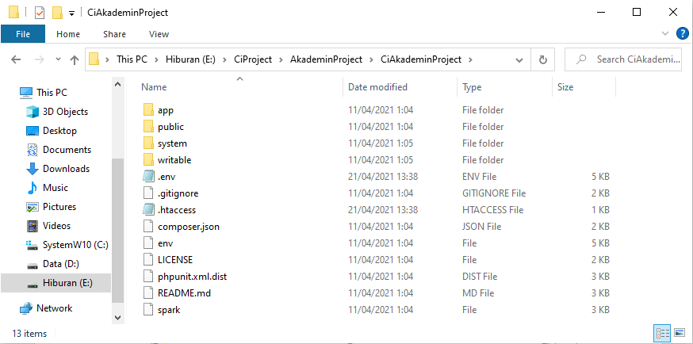

## Menjalankan Aplikasi

Sebelum menjalankan aplikasi yang sudah kamu buat pastikan kamu sudah menyalakan XAMPP berupa **Apache Server** dan juga **DBMS MySQl**.

Setelah itu aplikasi yang kamu buat dapat dijalankan secara manual ataupun dengan sekali klik menggunakan fitur `RUN`

### Menggunakan Fitur sekali klik

Untuk menggunakan fitur ini kamu hanya perlu memilih tombol `RUN` setelah proses `Create & Go` selesai.

Maka secara otomatis akan berjalan proses pada terminal atau CMD :

* Pembuatan Database pada **DBMS MySQL**
* Menjalankan `script` **php spark migrate**, **php spark seed:mainmenu**, dan juga **php spark serve**.
* Selanjutnya membuka browser secara otomatis dengan alamat aplikasi yang sedang dijalankan.

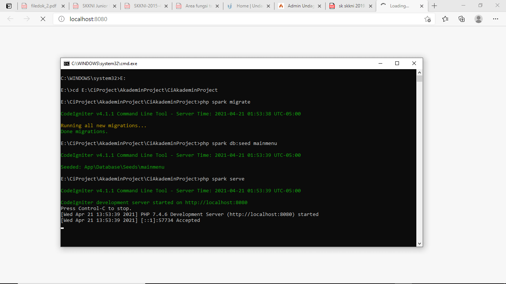

### Menjalankan Project Manual

Jika kamu ingin menjalankan project secara manual maka kamu harus memastikan kalau database sudah dibuat.

Namun jika database belum dibuat kamu dapat membuatnya terlebih dahulu sesuai keterangan projectmu. atau dapat dilihat pada property di bagian kanan.

Setelah database projectmu dibuat, kamu dapat menjalankan aplikasi melalui `CMD`atau terminal. Kemudian buka directory folder project seperti berikut.

```bash
e: 
cd CiProject
cd AkademikProject
cd CiAkademikProject
---------------
php spark migrate
```

Penjelasan mengenai script diatas adalah `e:` sesuaikan dengan partisi penyimpanan folder project karena di perangkat kami menyimpan di partisi E:,

`cd CiProject`,`cd AkademikProject`,`cd CiAkademikProject` sesuai dengan nama folder penyimpanan project. Perintah `cd` digunakan untuk mengubah atau berpindah antar directory atau folder.

`php spark migrate` menjalankan pembuatan tabel di dalam database yang sudah kamu buat. Jika belum ada maka tabel bau akan dibuat sesuai table atau frame yang sudah kamu susun sebelumnya. Sedangkan jika sudah ada tabel maka akan di ganti dengan table baru sesuai yang kamu buat. Proses migrasi akan terlihat seperti dibawah ini.

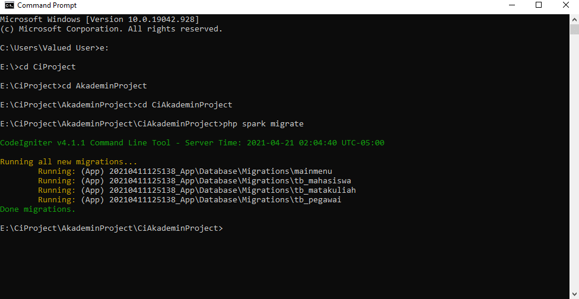

Selanjutnya untuk membuat menu di dalam aplikasimu kamu hanya perlu menjalankan script berikut ini.

```bash
php spark db:seed mainmenu
```

Script di atas digunakan untuk menambah menu ke dalam tabel menu yang ada di database, sehingga setiap menu akan dibuat dinamis.

Dan yang terakhir setelah semua proses berjalan success maka kamu tinggal menjalankan script berikut

```bash
php spark serve
# menjalankan aplikasi di browser dengan alamat default yaitu http://localhost:8080
```

setelah script diatas dijalankan maka kamu dapat membuka browser dan mengetikkan alamat `http://localhost:8080`, jika berhasil maka akan tampil halaman browser seperti ini.

Maka kamu dapat melihat program dengan hasil seperti ini pada browsermu.


Jika kamu ingin menyimpan data di dalam aplikasimu maka dapat menggunakan fitur add yang terlihat seperti ini

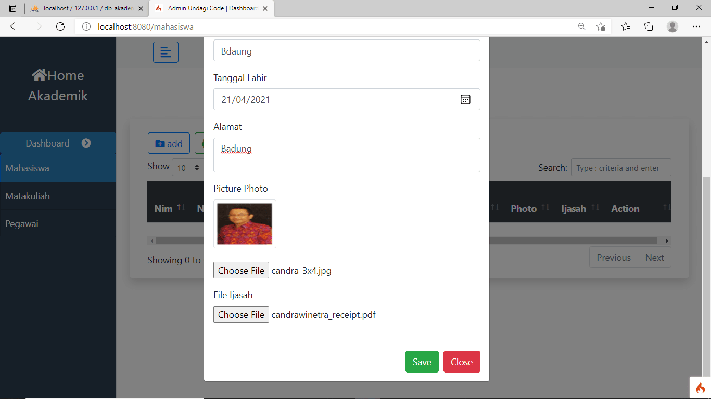

Jika berhasil dan sesuai dengan kolom yang sudah kamu masukkan maka data akan tersimpan seperti dibawah ini

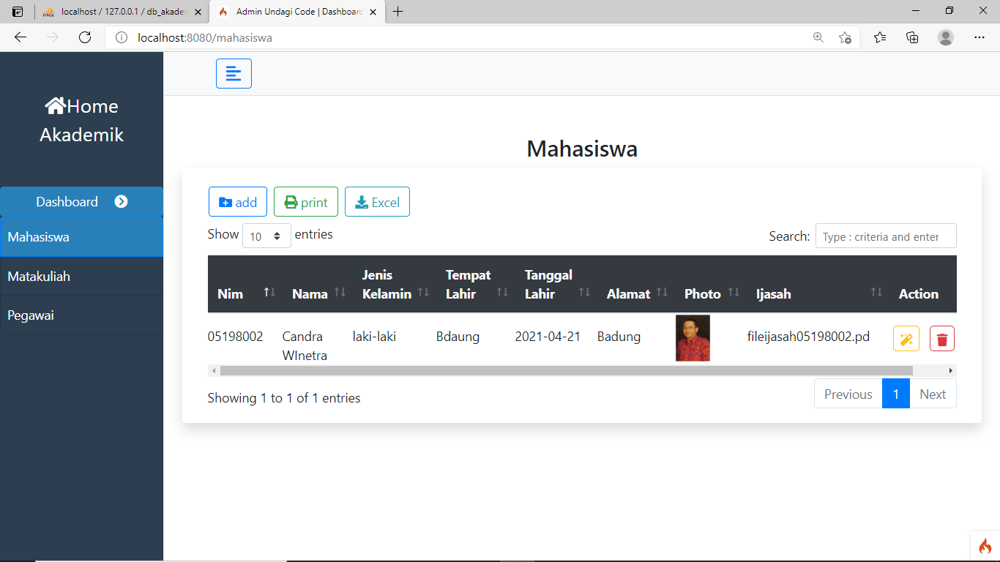

## Notes

Pada kasus browser tidak menampilkan halaman website yang sudah kamu buat saat menjalankan aplikasi menggunakan fitur `RUN` maka kamu bisa mereload(refresh) halaman tersebut. Ini terkadang disebabkan karena beberapa script belum selesai dijalankan tetapi browser sudah terbuka.

### Folder penyimpanan Images & Document

Penyimpanan file seperti gambar maupun dokumen tidak kedalam database, sehingga database yang kamu miliki tidak terlalu besar ukurannya.

oleh karena itu file akan tersimpan pada path berikut

```bash
# untuk mencari file document
E:\Workspace\(nama project)\Ci(namapr project)\public\uploads\Document
# untuk mencari file document
E:\Workspace\(nama project)\Ci(namapr project)\public\uploads\Images

# (nama project) sesuaikan nama dari project yang kamu buat 
```

Dan hasilnya dapat dilihat seperti berikut:


